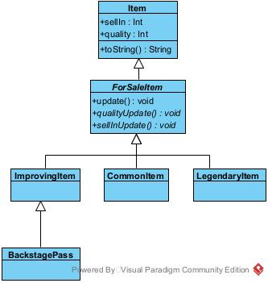

# Gilded-rose-java
Gilded rose java refactoring kata

# What is this?
It's a refactoring assignment excercise.
This is the original repo: https://github.com/emilybache/GildedRose-Refactoring-Kata.git 

# Disclamer
This repo is my interpretation of the assignment of the Gilded Rose, java version.

I do not claim this is the only correct way (or correct at all) as there could be multiple right solutions and interpretation for this problem.

# What did I do?
- I analized and translated the assignment into data descriptions in a way that worked for me such as:
```
Items: 
    sellIn
    quality

CommonItem -> Item:
    -1 quality every day
    -1 sellIn every day

    quality is max 50
    sellIn min is 0

ImprovingItem -> CommonItem:
    +1 quality every day

LegendaryItem -> SellingItem:
    never has to be sold
    never decreases in quality
    quality = 80

BackstagePass -> ImprovingItem:
    if sellIn > 10 quality+1 every day
    if 10>sellIn>5 quality +2 every day
    if sellIn < 5 quality +3 every day

ConjuredItem -> Item:
    -2 quality every day

Sulfuras is an object LegendaryItem

Aged Brie is an object of ImprovingItem

Backstage pass is an object of, well, BackstagePass

```

Then, I coded each behaviour and extracred an abstract superClass called "SellingItem"
which contains the update methods to override in each ageing item classes.
This way the updateQuality method inside the GildedRose code will be as short as a for loop and a method call.




# What I'm unhappy with

I don't know if I was allowed to edit the type of the array in the GildedRose class. (from Item to ForSaleItem)
I'm open to suggestions.
